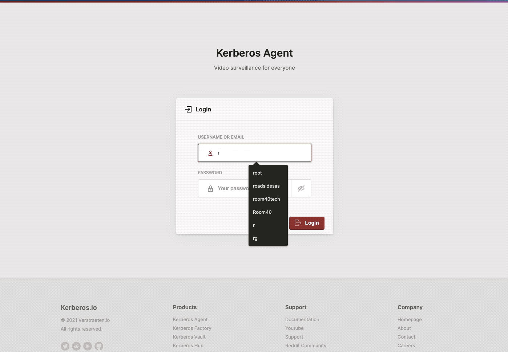
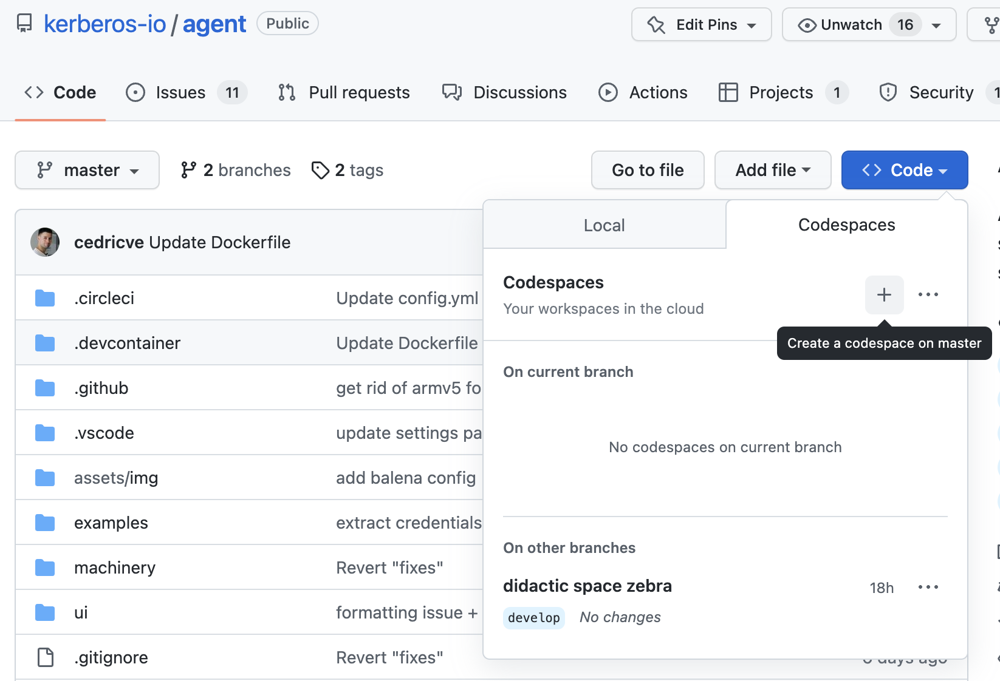
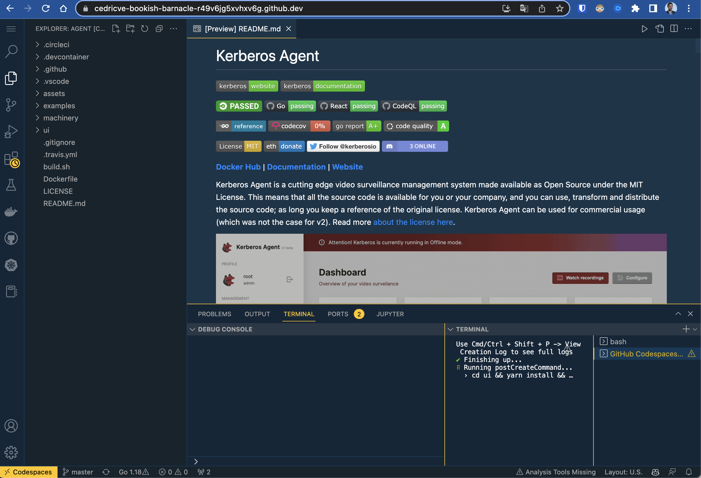
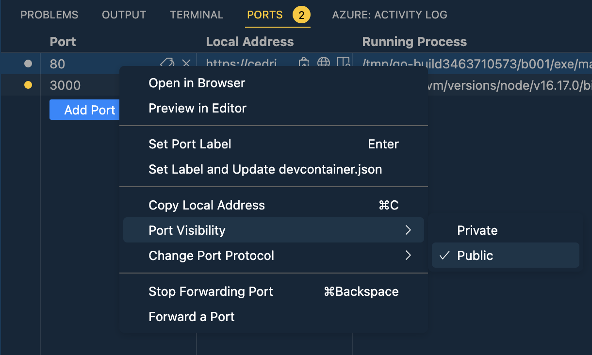
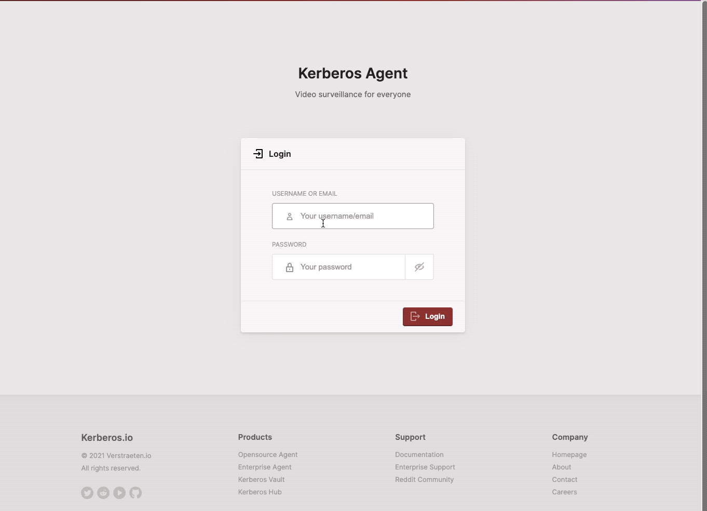
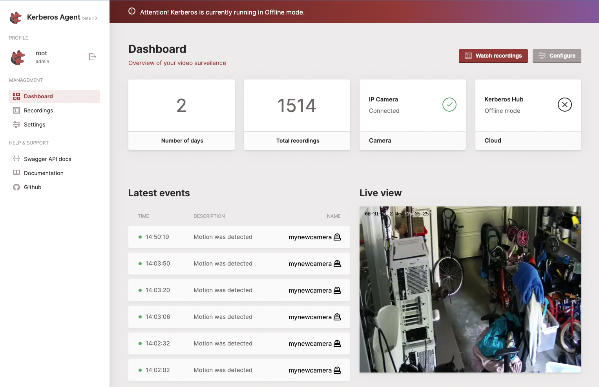
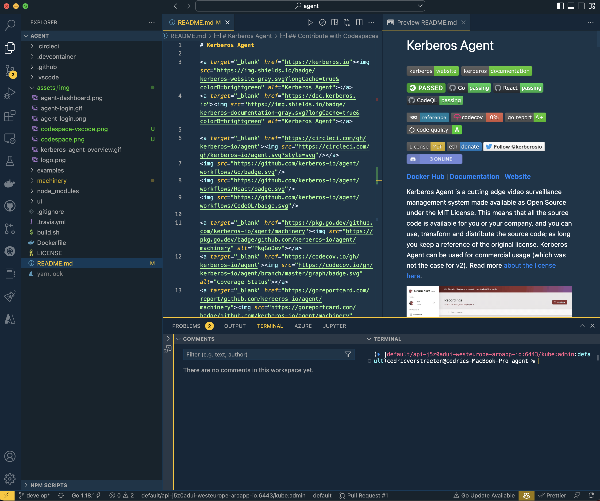

# Kerberos Agent

<a target="_blank" href="https://app.codacy.com/gh/kerberos-io/agent?utm_source=github.com&utm_medium=referral&utm_content=kerberos-io/agent&utm_campaign=Badge_Grade">

[**Docker Hub**](https://hub.docker.com/r/kerberos/agent) | [**Documentation**](https://doc.kerberos.io) | [**Website**](https://kerberos.io) | [**View Demo**](https://demo.kerberos.io)

Kerberos Agent is an isolated and scalable video (surveillance) management agent made available as Open Source under the MIT License. This means that all the source code is available for you or your company, and you can use, transform and distribute the source code; as long you keep a reference of the original license. Kerberos Agent can be used for commercial usage (which was not the case for v2). Read more [about the license here](LICENSE).

## :thinking: Prerequisites

- An IP camera which supports a RTSP H264 or H265 encoded stream,
  - (or) a USB camera, Raspberry Pi camera or other camera, that [you can transform to a valid RTSP H264 or H265 stream](https://github.com/kerberos-io/camera-to-rtsp).
- Any hardware (ARMv6, ARMv7, ARM64, AMD64) that can run a binary or container, for example: a Raspberry Pi, NVidia Jetson, Intel NUC, a VM, Bare metal machine or a full blown Kubernetes cluster.

## :video_camera: Is my camera working?

There are a myriad of cameras out there (USB, IP and other cameras), and it might be daunting to know if Kerberos Agent will work for your camera. [Therefore we are listing all the camera models that are acknowlegded by the community](https://github.com/kerberos-io/agent/issues/59). Feel free to add your camera to the list as well!

## :books: Overview

### Up and running in no time

1. [Quickstart - Docker](#quickstart---docker)
2. [Quickstart - Balena](#quickstart---balena)
3. [Quickstart - Snap](#quickstart---snap)

### Introduction

1. [A world of Kerberos Agents](#a-world-of-kerberos-agents)

### Running and automation

1. [How to run and deploy a Kerberos Agent](#how-to-run-and-deploy-a-kerberos-agent)
2. [Access the Kerberos Agent](#access-the-kerberos-agent)
3. [Configure and persist with volume mounts](#configure-and-persist-with-volume-mounts)
4. [Configure with environment variables](#configure-with-environment-variables)

### Insights

1. [Encryption](#encryption)
2. [H264 vs H265](#h264-vs-h265)

### Contributing

1. [Contribute with Codespaces](#contribute-with-codespaces)
2. [Develop and build](#develop-and-build)
3.  [Building from source](#building-from-source)
4.  [Building for Docker](#building-for-docker)

### Varia

1. [Support our project](#support-our-project)
1. [What is new?](#what-is-new)
1. [Contributors](#contributors)

## Quickstart - Docker

The easiest way to get your Kerberos Agent up and running is to use our public image on [Docker hub](https://hub.docker.com/r/kerberos/agent). Once you have selected a specific tag, run `docker` command below, which will open the web interface of your Kerberos agent on port `80`, and off you go. For a more configurable and persistent deployment have a look at [Running and automating a Kerberos Agent](#running-and-automating-a-kerberos-agent).

    docker run -p 80:80 --name mycamera -d --restart=always kerberos/agent:latest

If you want to connect to a USB or Raspberry Pi camera, [you'll need to run our side car container](https://github.com/kerberos-io/camera-to-rtsp) which proxies the camera to an RTSP stream. In that case you'll want to configure the Kerberos Agent container to run in the host network, so it can connect directly to the RTSP sidecar.

    docker run --network=host --name mycamera -d --restart=always kerberos/agent:latest

## Quickstart - Balena

Run Kerberos Agent with [Balena Cloud](https://www.balena.io/) super powers. Monitor your Kerberos Agent with seamless remote access, over the air updates, an encrypted public `https` endpoint and much more. Checkout our application `video-surveillance` on [Balena Hub](https://hub.balena.io/apps/2064752/video-surveillance), and create your first or fleet of Kerberos Agent(s).

## Quickstart - Snap

Run Kerberos Agent with our [Snapcraft package](https://snapcraft.io/kerberosio).

     snap install kerberosio

Once installed you can find your Kerberos Agent configration at `/var/snap/kerberosio/common`. Run the Kerberos Agent as following

    sudo kerberosio.agent -action=run -port=80

## A world of Kerberos Agents

The Kerberos Agent is an isolated and scalable video (surveillance) management agent with a strong focus on user experience, scalability, resilience, extension and integration. Next to the Kerberos Agent, Kerberos.io provides many other tools such as [Kerberos Factory](https://github.com/kerberos-io/factory), [Kerberos Vault](https://github.com/kerberos-io/vault), and [Kerberos Hub](https://github.com/kerberos-io/hub) to provide additional capabilities: bring your own cloud, bring your own storage, central overview, live streaming, machine learning, etc.

As mentioned above Kerberos.io applies the concept of agents. An agent is running next to (or on) your camera, and is processing a single camera feed. It applies motion based or continuous recording and makes those recordings available through a user friendly web interface. A Kerberos Agent allows you to connect to other cloud services or integrate with custom applications. Kerberos Agent is used for personal applications and scales to enterprise production level deployments.

This repository contains everything you'll need to know about our core product, Kerberos Agent. Below you'll find a brief list of features and functions.

- Low memory and CPU usage.
- Simplified and modern user interface.
- Multi architecture (ARMv6, ARMv7, ARM64, AMD64)
- Multi stream, for example recording in H265, live streaming and motion detection in H264.
- Multi camera support: IP Cameras (H264 and H265), USB cameras and Raspberry Pi Cameras [through a RTSP proxy](https://github.com/kerberos-io/camera-to-rtsp).
- Single camera per instance (e.g. one container per camera).
- Low resolution streaming through MQTT and high resolution streaming through WebRTC (only supports H264/PCM).
- Backchannel audio from Kerberos Hub to IP camera (requires PCM ULAW codec)
- Audio (AAC) and video (H264/H265) recording in MP4 container.
- End-to-end encryption through MQTT using RSA and AES (livestreaming, ONVIF, remote configuration, etc)
- Conditional recording: offline mode, motion region, time table, continuous recording, webhook condition etc.
- Post- and pre-recording for motion detection.
- Encryption at rest using AES-256-CBC.
- Ability to create fragmented recordings, and streaming through HLS fMP4.
- [Deploy where you want](#how-to-run-and-deploy-a-kerberos-agent) with the tools you use: `docker`, `docker compose`, `ansible`, `terraform`, `kubernetes`, etc.
- Cloud storage/persistance: Kerberos Hub, Kerberos Vault and Dropbox. [(WIP: Minio, Storj, Google Drive, FTP etc.)](https://github.com/kerberos-io/agent/issues/95)
- Outputs: trigger an integration (Webhooks, MQTT, Script, etc) when a specific event (motion detection or start recording ) occurs
- REST API access and documentation through Swagger (trigger recording, update configuration, etc).
- MIT License

## How to run and deploy a Kerberos Agent

A Kerberos Agent, as previously mentioned, is a container. You can deploy it using various methods and automation tools, including `docker`, `docker compose`, `kubernetes` and more. To streamline your Kerberos.io experience, we provide concrete deployment examples to speed up your Kerberos.io journey”

We have documented the different deployment models [in the `deployments` directory](https://github.com/kerberos-io/agent/tree/master/deployments) of this repository. There you'll learn and find how to deploy using:

- [Static binary](https://github.com/kerberos-io/agent/tree/master/deployments#0-static-binary)
- [Docker](https://github.com/kerberos-io/agent/tree/master/deployments#1-docker)
- [Docker Compose](https://github.com/kerberos-io/agent/tree/master/deployments#2-docker-compose)
- [Kubernetes](https://github.com/kerberos-io/agent/tree/master/deployments#3-kubernetes)
- [Red Hat OpenShift with Ansible](https://github.com/kerberos-io/agent/tree/master/deployments#4-red-hat-ansible-and-openshift)
- [Terraform](https://github.com/kerberos-io/agent/tree/master/deployments#5-terraform)
- [Salt](https://github.com/kerberos-io/agent/tree/master/deployments#6-salt)
- [Balena](https://github.com/kerberos-io/agent/tree/master/deployments#8-balena)
- [Snap](https://github.com/kerberos-io/agent/tree/master/deployments#9-snap)

By default, your Kerberos Agents store all configuration and recordings within the container. To help you automate and have a more consistent data governance, you can attach volumes to configure and persist data of your Kerberos Agents and/or configure each Kerberos Agent through environment variables.

## Access the Kerberos Agent

Once you have deployed the Kerberos Agent, using one of the deployment models described above, you will be able to access the Kerberos Agent user interface. A login page is presented asking for some credentials.

The default username and password for the Kerberos Agent is:

- Username: `root`
- Password: `root`

**_Please note that you change the username and password for a final installation, see [Configure with environment variables](#configure-with-environment-variables) below._**

## Configure and persist with volume mounts

An example of how to mount a host directory is shown below using `docker`, but is applicable for [all of the deployment models and tools described above](#running-and-automating-a-kerberos-agent).

You attach a volume to your container by leveraging the `-v` option. To mount your own configuration file and recordings folder, run the following commands:

    docker run -p 80:80 --name mycamera \
    -v $(pwd)/agent/config:/home/agent/data/config \
    -v $(pwd)/agent/recordings:/home/agent/data/recordings \
    -d --restart=always kerberos/agent:latest

More examples for each deployment and automation tool [can be found in the deployment section](https://github.com/kerberos-io/agent/tree/master/deployments). Be sure to verify the permissions of the directory/volume you are attaching. More information in [this issue](https://github.com/kerberos-io/agent/issues/80).

    chmod -R 755 kerberos-agent/
    chown 100:101 kerberos-agent/ -R

## Configure with environment variables

Next to attaching the configuration file, it is also possible to override the configuration with environment variables. This makes deploying with `docker compose` or `kubernetes` much easier and more scalable. Using this approach, we simplify automation through `ansible` and `terraform`.

    docker run -p 80:80 --name mycamera \
    -e AGENT_NAME=mycamera \
    -e AGENT_TIMEZONE=Europe/Brussels \
    -e AGENT_CAPTURE_IPCAMERA_RTSP=rtsp://fake.kerberos.io/stream \
    -e AGENT_CAPTURE_CONTINUOUS=true \
    -d --restart=always kerberos/agent:latest

| Name                                    | Description                                                                                     | Default Value                  |
| --------------------------------------- | ----------------------------------------------------------------------------------------------- | ------------------------------ |
| `LOG_LEVEL`                             | Level for logging, could be "info", "warning", "debug", "error" or "fatal".                     | "info"                         |
| `LOG_OUTPUT`                            | Logging output format "json" or "text".                                                         | "text"                         |
| `AGENT_MODE`                            | You can choose to run this in 'release' for production, and or 'demo' for showcasing.           | "release"                      |
| `AGENT_TLS_INSECURE`                    | Specify if you want to use `InsecureSkipVerify` for the internal HTTP client.                   | "false"                        |
| `AGENT_USERNAME`                        | The username used to authenticate against the Kerberos Agent login page.                        | "root"                         |
| `AGENT_PASSWORD`                        | The password used to authenticate against the Kerberos Agent login page.                        | "root"                         |
| `AGENT_KEY`                             | A unique identifier for your Kerberos Agent, this is auto-generated but can be overriden.       | ""                             |
| `AGENT_NAME`                            | The agent friendly-name.                                                                        | "agent"                        |
| `AGENT_TIMEZONE`                        | Timezone which is used for converting time.                                                     | "Africa/Ceuta"                 |
| `AGENT_REMOVE_AFTER_UPLOAD`             | When enabled, recordings uploaded successfully to a storage will be removed from disk.          | "true"                         |
| `AGENT_OFFLINE`                         | Makes sure no external connection is made.                                                      | "false"                        |
| `AGENT_AUTO_CLEAN`                      | Cleans up the recordings directory.                                                             | "true"                         |
| `AGENT_AUTO_CLEAN_MAX_SIZE`             | If `AUTO_CLEAN` enabled, set the max size of the recordings directory (in MB).                  | "100"                          |
| `AGENT_TIME`                            | Enable the timetable for Kerberos Agent                                                         | "false"                        |
| `AGENT_TIMETABLE`                       | A (weekly) time table to specify when to make recordings "start1,end1,start2,end2;start1..      | ""                             |
| `AGENT_REGION_POLYGON`                  | A single polygon set for motion detection: "x1,y1;x2,y2;x3,y3;...                               | ""                             |
| `AGENT_CAPTURE_IPCAMERA_RTSP`           | Full-HD RTSP endpoint to the camera you're targetting.                                          | ""                             |
| `AGENT_CAPTURE_IPCAMERA_SUB_RTSP`       | Sub-stream RTSP endpoint used for livestreaming (WebRTC).                                       | ""                             |
| `AGENT_CAPTURE_IPCAMERA_ONVIF`          | Mark as a compliant ONVIF device.                                                               | ""                             |
| `AGENT_CAPTURE_IPCAMERA_ONVIF_XADDR`    | ONVIF endpoint/address running on the camera.                                                   | ""                             |
| `AGENT_CAPTURE_IPCAMERA_ONVIF_USERNAME` | ONVIF username to authenticate against.                                                         | ""                             |
| `AGENT_CAPTURE_IPCAMERA_ONVIF_PASSWORD` | ONVIF password to authenticate against.                                                         | ""                             |
| `AGENT_CAPTURE_MOTION`                  | Toggle for enabling or disabling motion.                                                        | "true"                         |
| `AGENT_CAPTURE_LIVEVIEW`                | Toggle for enabling or disabling liveview.                                                      | "true"                         |
| `AGENT_CAPTURE_SNAPSHOTS`               | Toggle for enabling or disabling snapshot generation.                                           | "true"                         |
| `AGENT_CAPTURE_RECORDING`               | Toggle for enabling making recordings.                                                          | "true"                         |
| `AGENT_CAPTURE_CONTINUOUS`              | Toggle for enabling continuous "true" or motion "false".                                        | "false"                        |
| `AGENT_CAPTURE_PRERECORDING`            | If `CONTINUOUS` set to `false`, specify the recording time (seconds) before/after motion event. | "10"                           |
| `AGENT_CAPTURE_POSTRECORDING`           | If `CONTINUOUS` set to `false`, specify the recording time (seconds) after motion event.        | "20"                           |
| `AGENT_CAPTURE_MAXLENGTH`               | The maximum length of a single recording (seconds).                                             | "30"                           |
| `AGENT_CAPTURE_PIXEL_CHANGE`            | If `CONTINUOUS` set to `false`, the number of pixel require to change before motion triggers.   | "150"                          |
| `AGENT_CAPTURE_FRAGMENTED`              | Set the format of the recorded MP4 to fragmented (suitable for HLS).                            | "false"                        |
| `AGENT_CAPTURE_FRAGMENTED_DURATION`     | If `AGENT_CAPTURE_FRAGMENTED` set to `true`, define the duration (seconds) of a fragment.       | "8"                            |
| `AGENT_MQTT_URI`                        | An MQTT broker endpoint that is used for bi-directional communication (live view, onvif, etc)   | "tcp://mqtt.kerberos.io:1883"  |
| `AGENT_MQTT_USERNAME`                   | Username of the MQTT broker.                                                                    | ""                             |
| `AGENT_MQTT_PASSWORD`                   | Password of the MQTT broker.                                                                    | ""                             |
| `AGENT_REALTIME_PROCESSING`             | If `AGENT_REALTIME_PROCESSING` set to `true`, the agent will send key frames to the topic       | ""                             |
| `AGENT_REALTIME_PROCESSING_TOPIC`       | The topic to which keyframes will be sent in base64 encoded format.                             | ""                             |
| `AGENT_STUN_URI`                        | When using WebRTC, you'll need to provide a STUN server.                                        | "stun:turn.kerberos.io:8443"   |
| `AGENT_FORCE_TURN`                      | Force using a TURN server, by generating relay candidates only.                                 | "false"   |
| `AGENT_TURN_URI`                        | When using WebRTC, you'll need to provide a TURN server.                                        | "turn:turn.kerberos.io:8443"   |
| `AGENT_TURN_USERNAME`                   | TURN username used for WebRTC.                                                                  | "username1"                    |
| `AGENT_TURN_PASSWORD`                   | TURN password used for WebRTC.                                                                  | "password1"                    |
| `AGENT_CLOUD`                           | Store recordings in Kerberos Hub (s3), Kerberos Vault (kstorage), or Dropbox (dropbox).          | "s3"                           |
| `AGENT_HUB_ENCRYPTION`                  | Turning on/off encryption of traffic from your Kerberos Agent to Kerberos Hub.                  | "true"                         |
| `AGENT_HUB_URI`                         | The Kerberos Hub API, defaults to our Kerberos Hub SAAS.                                        | "https://api.hub.domain.com"   |
| `AGENT_HUB_KEY`                         | The access key linked to your account in Kerberos Hub.                                          | ""                             |
| `AGENT_HUB_PRIVATE_KEY`                 | The secret access key linked to your account in Kerberos Hub.                                   | ""                             |
| `AGENT_HUB_REGION`                      | The Kerberos Hub region, to which you want to upload.                                           | ""                             |
| `AGENT_HUB_SITE`                        | The site ID of a site you've created in your Kerberos Hub account.                              | ""                             |
| `AGENT_KERBEROSVAULT_URI`               | The Kerberos Vault API url.                                                                     | "https://vault.domain.com/api" |
| `AGENT_KERBEROSVAULT_ACCESS_KEY`        | The access key of a Kerberos Vault account.                                                     | ""                             |
| `AGENT_KERBEROSVAULT_SECRET_KEY`        | The secret key of a Kerberos Vault account.                                                     | ""                             |
| `AGENT_KERBEROSVAULT_PROVIDER`          | A Kerberos Vault provider you have created (optional).                                          | ""                             |
| `AGENT_KERBEROSVAULT_DIRECTORY`         | The directory, in the Kerberos vault, where the recordings will be stored.                      | ""                             |
| `AGENT_DROPBOX_ACCESS_TOKEN`            | The Access Token from your Dropbox app, that is used to leverage the Dropbox SDK.               | ""                             |
| `AGENT_DROPBOX_DIRECTORY`               | The directory, in Dropbox, where the recordings will be stored.                                 | ""                             |
| `AGENT_ENCRYPTION`                      | Enable 'true' or disable 'false' end-to-end encryption for MQTT messages.                       | "false"                        |
| `AGENT_ENCRYPTION_RECORDINGS`           | Enable 'true' or disable 'false' end-to-end encryption for recordings.                          | "false"                        |
| `AGENT_ENCRYPTION_FINGERPRINT`          | The fingerprint of the keypair (public/private keys), so you know which one to use.             | ""                             |
| `AGENT_ENCRYPTION_PRIVATE_KEY`          | The private key (assymetric/RSA) to decrypt and sign requests send over MQTT.                   | ""                             |
| `AGENT_ENCRYPTION_SYMMETRIC_KEY`        | The symmetric key (AES) to encrypt and decrypt requests sent over MQTT.                         | ""                             |

## Encryption

You can encrypt your recordings and outgoing MQTT messages with your own AES and RSA keys by enabling the encryption settings. Once enabled, all your recordings will be encrypted using AES-256-CBC and your symmetric key. You can use the default `openssl` toolchain to decrypt the recordings with your AES key, as following:

    openssl aes-256-cbc -d -md md5 -in encrypted.mp4 -out decrypted.mp4 -k your-key-96ab185xxxxxxxcxxxxxxxx6a59c62e8

Or you can decrypt a folder of recordings, using the Kerberos Agent binary as following:

    go run main.go -action decrypt ./data/recordings your-key-96ab185xxxxxxxcxxxxxxxx6a59c62e8

Or for a single file:

    go run main.go -action decrypt ./data/recordings/video.mp4 your-key-96ab185xxxxxxxcxxxxxxxx6a59c62e8

## H264 vs H265

If we talk about video encoders and decoders (codecs) there are 2 major video codecs on the market: H264 and H265. Taking into account your use case, you might use one over the other. We will provide an (not complete) overview of the advantages and disadvantages of each codec in the field of video surveillance and video analytics. If you would like to know more, you should look for additional resources on the internet (or if you like to read physical items, books still exists nowadays).

- H264 (also known as AVC or MPEG-4 Part 10)
  - Is the most common one and most widely supported for IP cameras.
  - Supported in the majority of browsers, operating system, and third-party applications.
  - Can be embedded in commercial and 3rd party applications.
  - Different levels of compression (high, medium, low, ..)
  - Better quality / compression ratio, shows less artifacts at medium compression ratios.
  - Does support technologies such as WebRTC

- H265 (also known as HEVC)
  - Is not supported on legacy cameras, though becoming rapidly available on "newer" IP cameras.
  - Might not always be supported due to licensing. For example not supported in browers on a Linux distro.
  - Requires licensing when embedding in a commercial product (be careful).
  - Higher levels of compression (50% more than H264).
  - H265 shows artifacts in motion based environments (which is less with H264).
  - Recording the same video (resolution, duration and FPS) in H264 and H265 will result in approx 50% the file size.
  - Not supported in technologies such as WebRTC
  
Conclusion: depending on the use case you might choose one over the other, and you can use both at the same time. For example you can use H264 (main stream) for livestreaming, and H265 (sub stream) for recording. If you wish to play recordings in a cross-platform and cross-browser environment, you might opt for H264 for better support.

## Contribute with Codespaces

One of the major blockers for letting you contribute to an Open Source project is to set up your local development machine. Why? Because you might already have some tools and libraries installed that are used for other projects, and the libraries you would need for Kerberos Agent, for example FFmpeg, might require a different version. Welcome to dependency hell...

By leveraging codespaces, which the Kerberos Agent repo supports, you will be able to set up the required development environment in a few minutes. By opening the `<> Code` tab on the top of the page, you will be able to create a codespace, [using the Kerberos Devcontainer](https://github.com/kerberos-io/devcontainer) base image. This image requires all the relevant dependencies: FFmpeg, OpenCV, Golang, Node, Yarn, etc.

After a few minutes, you will see a beautiful `Visual Studio Code` shown in your browser, and you are ready to code!

On opening of the GitHub Codespace, some dependencies will be installed. Once this is done go ahead to the `ui/src/config.json` file, and (un)comment following section. Make sure to replace the `externalHost` variable with the DNS name you will retrieve from the next step.

    // Uncomment this when using codespaces or other special DNS names (which you can't control)
    // replace this with the DNS name of the kerberos agent server (the codespace url)
    const externalHost = 'cedricve-automatic-computing-machine-v647rxvj4whx9qp-80.preview.app.github.dev';

    const dev = {
      ENV: 'dev',
      HOSTNAME: externalHost,
      //API_URL: `${protocol}//${hostname}:80/api`,
      //URL: `${protocol}//${hostname}:80`,
      //WS_URL: `${websocketprotocol}//${hostname}:80/ws`,

      // Uncomment, and comment the above lines, when using codespaces or other special DNS names (which you can't control)
      API_URL: `${protocol}//${externalHost}/api`,
      URL: `${protocol}//${externalHost}`,
      WS_URL: `${websocketprotocol}//${externalHost}/ws`,
    };

Go and open two terminals: one for the `ui` project and one for the `machinery` project.

1.  Terminal A:

        cd machinery/
        go run main.go -action run -port 80

2.  Terminal B:

        cd ui/
        yarn start

Once executed, a popup will show up mentioning `portforwarding`. You should see two ports being opened, one for the ui `3000` and one for the machinery `80`. `Right-click` on the port `80` and change visibility from `private` to `public`, this is required to avoid `CORS` errors.

As mentioned above, copy the hostname of the `machinery` DNS name, and paste it in the `ui/src/config.json` file. Once done, reload the `ui` page in your browser, and you should be able to access the login page with the default credentials `root` and `root`.

## Develop and build

The Kerberos Agent is divided in two parts: a `machinery` and `web` part. Both parts live in this repository in their relative folders. For development or running the application on your local machine, you have to run both the `machinery` and the `web` as described below. When running in production everything is shipped as only one artifact, read more about this at [Building for production](#building-for-production).

### UI

The `web` is a **React** project which is the main entry point for an end user to view recordings, a livestream, and modify the configuration of the `machinery`.

    git clone https://github.com/kerberos-io/agent
    cd ui
    yarn start

This will start a webserver and launches the web app on port `3000`.

Once signed in you'll see the dashboard page. After successfull configuration of your agent, you'll should see a live view and possible events recorded to disk.

### Machinery

The `machinery` is a **Golang** project which delivers two functions: it acts as the Kerberos Agent which is doing all the heavy lifting with camera processing and other kinds of logic and on the other hand it acts as a webserver (Rest API) that allows communication from the web (React) or any other custom application. The API is documented using `swagger`.

You can simply run the `machinery` using following commands.

    git clone https://github.com/kerberos-io/agent
    cd machinery
    go run main.go -action run -port 80

This will launch the Kerberos Agent and run a webserver on port `80`. You can change the port by your own preference. We strongly support the usage of [Goland](https://www.jetbrains.com/go/) or [Visual Studio Code](https://code.visualstudio.com/), as it comes with all the debugging and linting features built in.

## Building from source

Running Kerberos Agent in production only requires a single binary to run. Nevertheless, we have two parts: the `machinery` and the `web`, we merge them during build time. So this is what happens.

### UI

To build the Kerberos Agent web app, you simply have to run the `build` command of `yarn`. This will create a `build` directory inside the `web` directory, which contains a minified version of the React application. Other than that, we [also move](https://github.com/kerberos-io/agent/blob/master/web/package.json#L16) this `build` directory to the `machinery` directory.

    cd ui
    yarn build

### Machinery

Building the `machinery` is also super easy 🚀, by using `go build` you can create a single binary which ships it all; thank you Golang. After building you will end up with a binary called `main`, this is what contains everything you need to run Kerberos Agent.

Remember the build step of the `web` part, during build time we move the build directory to the `machinery` directory. Inside the `machinery` web server [we reference the](https://github.com/kerberos-io/agent/blob/master/machinery/src/routers/http/Server.go#L44) `build` directory. This makes it possible to just a have single web server that runs it all.

    cd machinery
    go build

## Building for Docker

Inside the root of this `agent` repository, you will find a `Dockerfile`. This file contains the instructions for building and shipping a **Kerberos Agent**. Important to note is that you start from a prebuilt base image, `kerberos/base:xxx`.
This base image already contains a couple of tools, such as Golang, FFmpeg and OpenCV. We do this for faster compilation times.

By running the `docker build` command, you will create the Kerberos Agent Docker image. After building you can simply run the image as a Docker container.

    docker build -t kerberos/agent .

## What is new?

This repository contains the next generation of Kerberos.io, **Kerberos Agent (v3)**, and is the successor of the machinery and web repositories. A switch in technologies and architecture has been made. This version is still under active development and can be followed on the [develop branch](https://github.com/kerberos-io/agent/tree/develop) and [project overview](https://github.com/kerberos-io/agent/projects/1).

Read more about this [at the FAQ](#faq) below.

## Contributors

This project exists thanks to all the people who contribute.

