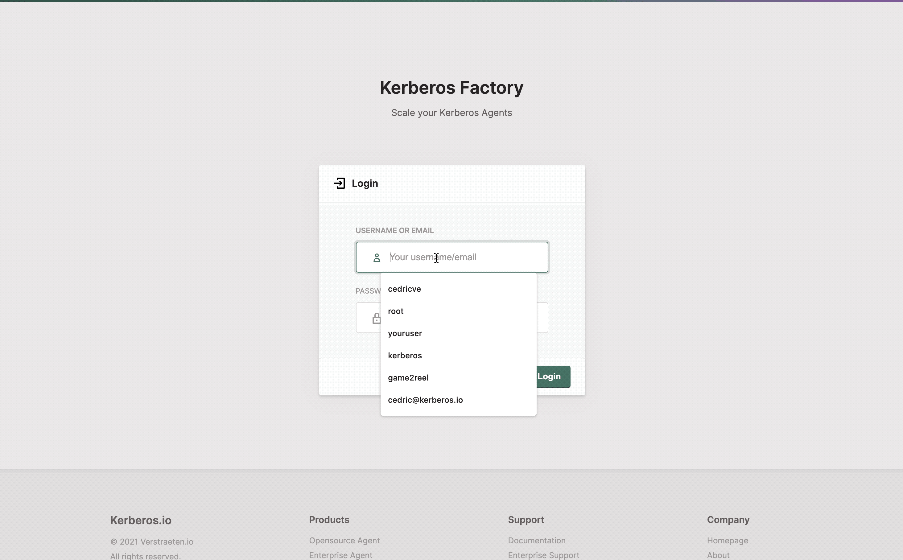

# Deploy with Kerberos Factory

All of the previously deployments, `docker`, `kubernetes` and `openshift` are great for a technical audience. However for business users, it might be more convenient to have a clean web ui, that one can leverage to add one or more cameras (Kerberos Agents), without the hassle of the technical resources.

That's exactly why we have build [Kerberos Factory](https://github.com/kerberos-io/factory). It's a web ui on top of a Kubernetes cluster, which allows a non-technical users to administer and configure a video landscape.

The idea of [Kerberos Factory](https://github.com/kerberos-io/factory) is that one can configure and deploy a camera, by filling-in some basic input fields. Once done [Kerberos Factory](https://github.com/kerberos-io/factory), will create the relevant resources in your Kubernetes cluster.
