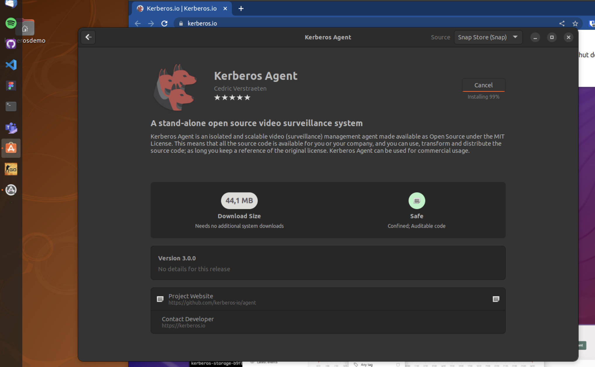

# Deployment with Snap Store

By browsing to the Snap Store, you'll be able [to find our own snap `Kerberos Agent`](https://snapcraft.io/kerberosio). You can either install the `Kerberos Agent` through the command line.

     snap install kerberosio

Or use the Desktop client to have a visual interface.

Once installed you can find your Kerberos Agent configration at `/var/snap/kerberosio/common`. Run the Kerberos Agent as following.

    sudo kerberosio.agent -action=run -port=80

If successfull you'll be able to browse to port `80` or if you defined a different port. This will open the Kerberos Agent interface.
